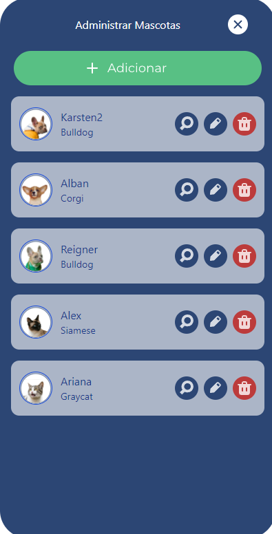
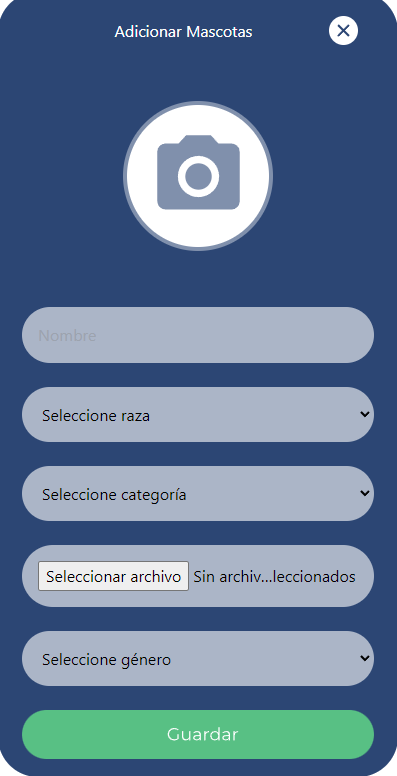

# CRUD para mascotas

### Herramientas 🛠️

- *Backend:* NodeJS - Express - MySQL2
- *Frontend:* ReactJS - Axios - Tailwind
- *Database:* MySQL

### Screenshots 📹

### Login

---

### Inicio

---

### Crear Mascota

